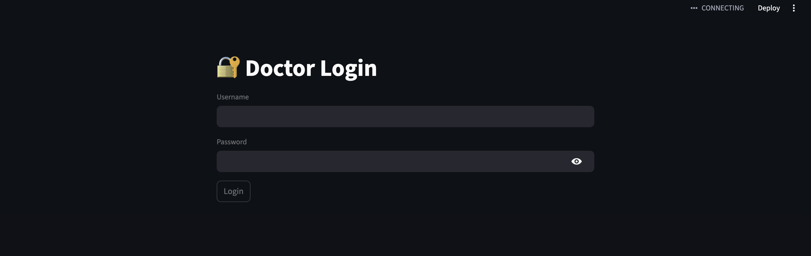
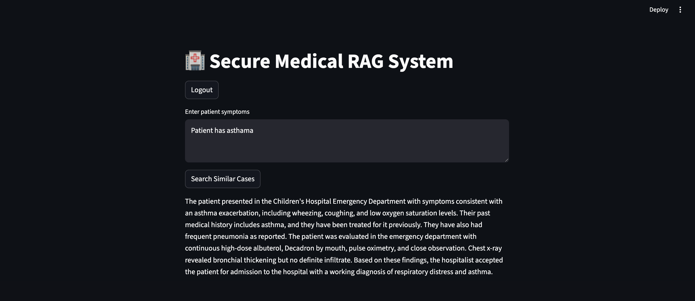

# 🏥 MediSecure RAG: Secure Medical Case Search

A secure **Retrieval-Augmented Generation (RAG)** system designed for healthcare professionals to search through medical transcriptions using **semantic search** and **local AI**.  
The system ensures **100% patient data privacy** by processing all embeddings and language modeling **locally**.




## 📑 Table of Contents

- [Overview](#overview)
- [Problem Statement](#problem-statement)
- [Solution Architecture](#solution-architecture)
- [Features](#features)
- [Technology Stack](#technology-stack)
- [Project Structure](#project-structure)
- [Setup and Installation](#setup-and-installation)
- [Usage Guide](#usage-guide)
- [Security Considerations](#security-considerations)
- [Author](#author)

---

## 🔍 Overview

**MediSecure RAG** is an AI-powered medical assistant that enables doctors to find similar patient cases based on symptoms or conditions.  

Unlike traditional keyword-based search systems, MediSecure RAG understands **medical context** using:

- **ChromaDB** for vector-based semantic retrieval  
- **Ollama (Mistral)** for generating professional clinical summaries  

All processing happens **locally**, making it suitable for privacy-sensitive hospital environments.

---

## ❓ Problem Statement

A private hospital required a secure system to manage thousands of unstructured patient notes while meeting strict privacy requirements:

- **Semantic Search**: Find past cases with similar symptoms using RAG  
- **Data Privacy**: No patient data can leave the local hospital network  
- **Authorized Access**: Only authenticated doctors can access the system  

Cloud-based AI solutions (OpenAI, etc.) were **not allowed**.

---

## 🏗 Solution Architecture

The system follows a **stateless FastAPI architecture** with a persistent local vector store.

### Core Components

1. **Ingestion Pipeline**
   - Reads medical transcription CSV
   - Generates embeddings locally
   - Persists vectors in ChromaDB

2. **Authentication Layer**
   - Validates credentials using hashed passwords
   - Issues JWT tokens for secure access

3. **RAG Pipeline**
   - Retrieves top-3 similar medical cases
   - Sends context to a local LLM (Mistral via Ollama)
   - Generates concise clinical summaries

---

## ✨ Features

- 🔐 **Stateless Authentication**
  - JWT-based login with HS256 signing

- 🧠 **Local Semantic Search**
  - Sentence-Transformers + ChromaDB

- 🤖 **Private AI Summarization**
  - Ollama running Mistral / Llama3 locally

- 💾 **Persistent Vector Store**
  - Embeddings survive restarts

- 🔑 **Strong Password Security**
  - Argon2 hashing (industry standard)

---

## 🛠 Technology Stack

| Component | Technology | Purpose |
|---------|-----------|--------|
| Backend | FastAPI | High-performance REST API |
| Vector DB | ChromaDB | Local persistent vector storage |
| LLM Engine | Ollama | Runs Mistral / Llama3 locally |
| Embeddings | Sentence-Transformers | Text-to-vector generation |
| Auth | JWT + Argon2 | Secure authentication |
| Data | Pandas | CSV data processing |

---

## 📂 Project Structure

```plaintext
Medi-Secure-RAG/
├── backend/
│   ├── auth.py          # JWT logic and dependency injection
│   ├── ingest.py        # Data processing and ChromaDB setup
│   ├── main.py          # FastAPI routes and server logic
│   ├── rag.py           # Retrieval and Ollama integration
│   └── users.py         # User DB and password hashing
├── data/
│   └── medical_transcriptions.csv  # Dataset
├── chroma_db/           # Persistent vector files (auto-generated)
├── .env                 # Secrets and configuration
├── requirements.txt     # Python dependencies
└── README.md            # Project documentation


⚙️ Setup and Installation
Prerequisites

Python 3.10+

Ollama installed and running

Python virtual environment (venv)

Step 1: Install Dependencies
pip install -r requirements.txt
ollama pull mistral

Step 2: Configure Environment

Create a .env file in the project root:

JWT_SECRET=your_32_character_hex_key
OLLAMA_URL=http://localhost:11434/api/generate
MODEL_NAME=mistral

Step 3: Ingest Medical Data

This builds the local vector database:

python backend/ingest.py

Step 4: Run the API
uvicorn backend.main:app --reload

🚀 Usage Guide
1️⃣ Authentication

Send a POST request to /login with credentials:

Username: abhimanyu

Password: doctor123

The API returns a JWT access_token.

2️⃣ Asking a Medical Query

Use the token in the Authorization header:

Authorization: Bearer <access_token>


Example Query:

Patient shows signs of acute chest pain and high blood pressure.

The RAG engine:

Retrieves similar past cases

Generates a professional clinical summary

🔐 Security Considerations

Zero Data Leakage

All computation happens on-premises

No cloud APIs or telemetry

Stateless Architecture

JWT-based auth improves scalability and security

Password Integrity

Argon2 hashing resists GPU-based brute-force attacks

# Learnings:
This assignment helped me understand how real-world AI systems are built beyond simple model usage. I learned how Retrieval-Augmented Generation (RAG) works end-to-end, starting from raw unstructured data to generating meaningful, context-aware responses.

Key learnings include:

How to preprocess and semantically index large volumes of unstructured medical text using embeddings

How vector databases like ChromaDB persist and retrieve information efficiently across application restarts

The importance of namespace consistency (tenant, database, collection) in production-grade vector databases

How to integrate a locally running LLM (via Ollama) instead of relying on cloud APIs

How JWT-based authentication enables stateless and secure APIs

Why strong password hashing algorithms like Argon2 are critical for security-sensitive applications

How to debug real-world issues related to persistence, process isolation, and backend–frontend communication

Overall, this project gave me hands-on experience in designing a secure, privacy-preserving AI system, similar to what is required in healthcare and enterprise environments.


# Technology Stack Justification 

FastAPI – Chosen for its high performance, built-in validation, and support for secure, stateless REST APIs.

ChromaDB – Used as a local vector database to enable fast semantic search while keeping all patient data on-premises.

Sentence-Transformers – Selected to generate high-quality semantic embeddings locally without relying on external APIs.

Ollama (Mistral) – Used to run large language models locally, ensuring zero data leakage and full privacy compliance.

JWT (JSON Web Tokens) – Enables stateless and scalable authentication without storing session data on the server.

Argon2 – Chosen for password hashing due to its resistance to brute-force and GPU-based attacks.

Pandas – Used for efficient preprocessing and handling of large CSV-based medical datasets.

# Author
Abhimanyu Singh Rathore